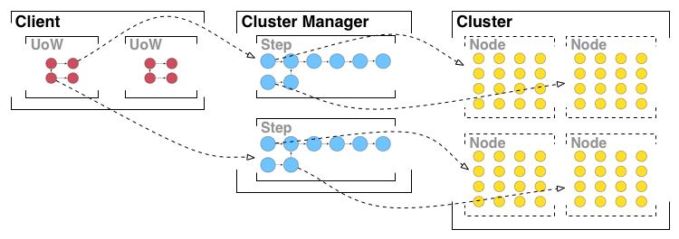

= Notes on Parallel Cluster Computing

An ontology to help practitioners characterize and compare modern day cluster
computing technologies.

== Purpose

This document attempts to outline various attributes of *current popular cluster
computing technologies* ranging from types of parallelization to supported
workload topologies.

The hope is that this ontology will help architects effectively evaluate new and
emerging technologies and/or frame any new efforts around their uniqueness and
subsequent benefits.

The catalog of attributes is not exhaustive and may over simplify many of the
categories. And out of laziness, some liberties have been made with definitions
and terms to retain brevity.

That said, there is some effort to separate design decisions around a platform
architecture from the features provided by a given implementation. For example,
supporting only an Directed In-Tree topology is a design decision, supporting
Off-Heap Memory storage for caching is a feature. To change, one requires a
re-design, the other requires more code. To some this may be semantics, but a
redesign at a high level may result in something effectively new.

Please feel free to open issues if clarity is needed or corrections are in
order.

=== Scope

There are many forms of computing cluster models. Here we attempting to remain
focused on the more _modern_ 21st century flavors rooted by Google's
https://en.wikipedia.org/wiki/MapReduce[MapReduce] and Microsoft's
https://en.wikipedia.org/wiki/Dryad_(programming)[Dryad]. Also including
conceptions around continuous stream processing as this has begun merging with
the aforementioned models.

Our modern clustered computing fabrics generally include a computing layer and a
tandem storage layer.

This document is focused on the computing layer, though aspects of various
distributed storage layers are leveraged by the computing layer - for example,
data block splitting and replication.

== Terms

Workflow:: A 'loosely' coupled collection of Units of Work to solve a business
problem typically arranged as a directed graph in the order of execution.

+

Out of scope of this document, but included to give context to what a Unit of
Work is and is not.

Unit of Work:: Commonly expressed as a query or SQL statement, domain level
syntax, a GUI based data flow, or some programatic API based workflow.

+

A business level workload that typically consumes one or more durable datasets
and outputs one or more durable datasets. Any operational data created within
the UoW is typically not considered valuable and discarded on completion.

+

A UoW may contain one or more Steps.

Step:: Commonly also known as a Job or a DAG.

+

A Step is the discrete workload requested to be executed on a given computing
platform.

+

A Step may contain one or more Nodes, represented as a directed graph with
varying properties and limitations.

Node:: Commonly known as a logical Mapper, Reducer, Stage, or Vertex. Not to be
confused with a host in a cluster, also commonly called a 'node'.

+

A Node is the actual logical workload executed, and may be further divided to
support data parallelism.

+

Subsequently a Node will have one or more Slices.

Slice:: Commonly known as a Task or Execution.

+

A Slice represents the physical workload that is applied to all or a portion of
a dataset and runs as an operating system process, e.g. within a Java Virtual
Machine on a given machine or container in a cluster. Alternately, Slices can be
threads within a single JVM, each thread handling a portion of the data.

Edge:: The logical connection between two Nodes, represents how the data is
physically transferred or routed between Slices.

Slot:: A virtual allocation on a host on a cluster were a Slice can execute. For
example, a 10 worker host cluster may have 10 Slots per host providing the
capacity for 100 Slices to execute concurrently. If Slices are threads, they
could be limited by a thread pool.

https://en.wikipedia.org/wiki/Data_set[Dataset]:: A collection of files or
tables and records that constitute a contiguous body of data.

https://en.wikipedia.org/wiki/Datum[Datum]:: A single piece of data like a
record or key. In many contexts a record is a pair of key and value datums.

== Model Design Attributes

These attributes are inherent to the underlying design implemented by the
platform.

These design attributes represent core capabilities inherent in the design. This
is different than providing a feature that may provide an optimization, or to
overcome a limitation to the core design itself.

=== Parallelism

==== Work Parallelism

Work Parallelism, division of labor, is where two or more work items on an
agenda can be performed simultaneously, if they are themselves independent of
one another.

Sequential:: Steps and/or Nodes must be presented sequentially, there is no
runtime concurrency of scheduled elements.

Parallel:: Steps and/or Nodes can be simultaneously scheduled and executed if
they are themselves independent of one another.

In practice, if two independent Steps or Nodes are scheduled, they may still
execute sequentially, but this is a function of the cluster capacity. If given
enough capacity, and all independent workloads can execute, the platform is
indeed parallel.

Step and Node parallelism are two different things on some platforms.

Step parallelism may in some cases be thought of as multi-tenancy within the
provisioned set of resources (a session or a context) to satisfy the full UoW.
Alternately on some platforms to gain Step parallelism, new resources must be
provisioned in the environment (a new session or context), this would not be
inherent Step Parallelism described above.

==== Data Parallelism

Data Parallelism is where each worker shares a common agenda item or activity,
but performs its work on a subset of the overall dataset allowing the workers to
work simultaneously.

Split:: Where each Node is parallelized via Slices to work on a portion of a
dataset, where each portion is split by size or number of records. That is, each
Slice, for a given Node, will execute on a split of the data. The number of
Slices is equal to the number of splits, and is a function of the data size when
the split size is held constant.

+

Logically, the first Node in a topology are split based since they must read
from a filesystem, as is the case for the Mapper in MapReduce.

Partitioned:: Where each Node is parallelized via Slices to work on a partition
or grouping of data, of which is grouped based on a portion of the given datum,
e.g. the value of a key or a hash of the key.

+

As an example, each Slice will execute on a subset of the data based on where
the hash of a given value falls into the set of available buckets or partitions
-- like a hash map. Which is the case for a Reducer in MapReduce.

NOTE: Parallelism based on hosts or resources should be defined/considered. That
is, if pulling data out of a N node sharded RDBMS, there are likely only N x M
Slices, where M is the number of connections to a given shard/host. In practice
the Split model is modified to support this (with M > 1, 'limit' and 'offset'
provide splitting), though it is sensitive to skew in the shard/partitioning
across the RDBMS instances in the sharded cluster.

=== Node Topology

Platforms can support various Node Topologies within a Step.

Two Node:: One or two Nodes max. As supported by the MapReduce model.

Directed In-Tree:: Multiple heads converge on a single tail, with no limit to
intermediate nodes in the tree, no Node may have an out degree greater than 1.
That is, supports joins, but not forks in the data path.

+

SQL statements typically fall out into this model as multiple tables can be
'select'ed and the result as a single table are returned or placed 'into' a
target table.

Directed Acyclic Graph:: Multiple heads, multiple tails, with in and out degrees
greater than 1 supported. That is, supports both joins and forks in the data
path.

Directed Acyclic MultiGraph:: Same as the DAG, but two nodes may have two or
more edges between them with unique properties.

+

This supports a form of 'self join' where each Edge represents the results of
unique forked data paths taken within the upstream Node.

NOTE: Since a Step is a directed graph of Nodes representing the scheduled
workload as seen by the platform, Step topologies are usually managed externally
from within the UoW itself, i.e. topological scheduling of Steps. Whether or not
Steps can be scheduled or executed concurrently is the usual limitation.

=== Node Data Routing

The type of data routing, movement, or distribution between a given Node pair
from within a Step.

Forward:: Also known as one-to-one. Data from one upstream Slice is directly
forwarded to a dependent downstream Slice.

Broadcast:: Also known as replicated. Data from one upstream Slice is copied to
every dependent downstream Slice. Every downstream Slice gets a complete copy
of all the upstream produced data across all upstream Slices.

+

In practice, Broadcast edge can be used in tandem with another edge Routing type
targeting the same Node to provide an asymmetrical join (where one side, the
broadcast data, can fit into memory).

Ordered Scatter-Gather:: Where each upstream Slice deterministically computes a
target downstream Slice for each 'record' or datum, and transfers that data to
the target Slice. Each downstream Slice will receive instances of data with the
same hash or key from each of the upstream Slices. Typically the guarantee is
that each Slice will see all records associated with the same unique key.

+

In the case of Ordered Scatter-Gather, all keys are presented to the Slice
instance in some pre-defined order, so that all the records for a given unique
key are handled together before the next unique key in the set.

+

In practice, a key is extracted from each record, a hash is computed, then using
that hash value, the target downstream Slice is deterministically determined.
For example: `( hash_value modulo total_num_slices ) = slice_ordinal`

+

This is frequently called 'shuffling', the phase between a Mapper and Reducer in
MapReduce, where the order can be configured by the developer.

Unordered Scatter-Gather:: The same mechanism as Ordered Scatter-Gather, but the
keys are presented to the target Node in no order, this can improve performance
if the target Node does not require each incoming record to be grouped with
values having the same unique key.

NOTE: For Data Routing between Nodes across Steps, see Intermediate Result
Availability.

=== Intermediate Result Availability

Intermediate Result Availability is where the results of a non-tail Node are
made available to downstream Nodes in a future Step. The future downstream Node
may in practice be the same upstream Node simply participating in the future
Step as a head Node.

Some platforms may call this caching.

Unavailable:: There is no innate mechanism to retain results for use by
downstream Node(s) in future Steps.

Available:: A Node can be 'marked' so that the underlying platform attempts to
retain the result of the Node in a way the data can be addressed and used in a
downstream Step.

For platforms that provide a DAG topology, Intermediate Result Availability is
not a necessary feature as forking a path, a Node with out degree greater than
1, is natural to the topology. Directed In-Tree models may require this feature
in order to provide (performant) forks in the data path (that will by necessity
span Steps).

NOTE: UoWs with multiple Steps will rely on the output of the upstream Node
tails to source the head Nodes on the downstream Steps. The implication is that
all systems make the results of tail Nodes available to subsequent head Nodes by
some means (commonly the Shared Filesystem) in order to be viable.

=== Staging

Simultaneous:: All Nodes or Slices must be simultaneously running and available
for computation to begin. Typical of online streaming systems.

Incremental:: Only a subset of Node and/or Slices can be running and available
for the computation to begin.

+

That is, two Nodes can be scheduled from a single Step, the first upstream Node
executes first, but only a fraction of the required Slices can run
simultaneously, forcing the next fraction to run after the first set of Slices
complete.

Incremental Staging is important for batch systems to be 'scale-free'. Allowing
for incremental staging of Nodes and Slices, a workload of any (fluctuating)
size can run on any cluster of any arbitrary size. That is, it isn't required
that the operator guarantee enough computing nodes to match the workload demand
all at once.

=== Mode

Offline:: Also known as batch. Requires the dataset to be completely available
before the computation can complete.

+

Batch is typically considered high latency (of arrival of results), but models
like 'micro batch' attempt to relax some constraints of typical batch systems
in order to improve latency.

Online:: Also known as streaming, or continuous event processing. Does not
require the complete dataset to be available to provide results of the
computation.

+

Frequently the results are approximations where aggregate values are given.

Many deployments use a hybrid of Offline and Online systems to solve a business
problem. If the same technology can be used for both Offline and Online (or high
and low latency results) computation, a given architecture can be simpler to
deploy and maintain. Assuming the competing forces and complexity of supporting
both modes allow the system to be robust.

== Implementation Features

=== Speculative Execution

Where two or more Slices, executing under the same logical Node are also
executing on exactly the same split or partition of data. On platforms with
extra capacity this can improve performance by mitigating against a single Slice
failing thus causing an overall delay due to a retry, or against a Slice running
slower because of failing hardware or network issues. The first Slice attempt to
complete successfully wins.

Unavailable:: Platform does not provide speculative execution.

Available:: Platform does provide speculative execution.

=== Data Routing Service

Either Node Slices or an external service is responsible for routing data from
the upstream Node Slices to the downstream Node Slices within a Step.

An external service provided by the platform would take on the responsibility of
making data available to downstream Slices on behalf of the source Slices with
the intention to provide additional fault tolerance, some optimization on the
routing, and/or free up any Slots used by the upstream Slices earlier.

Unavailable:: Platform does not provide a routing service.

Available:: Platform does provide a routing service.

=== Routed Data Durability

Related to Node Routing Service, the possible mechanisms provided by
the platform to manage the durability of Node results.

Shared Filesystem:: A shared distributed filesystem. Possibly the slowest but
more reliable storage medium, depending on filesystem implementation.

Local Filesystem:: Saved to local disk, and made available, over possibly
proprietary means, to possibly remote Slices within downstream Nodes over the
network.

On-Heap Memory:: Same effectively as the Local Filesystem except data is stored
on-heap within a host process.

Off-Heap Memory:: Same effectively as the Local Filesystem except data is stored
off-heap within a host process. Off-heap memory is frequently considered an
optimization over On-Heap Memory use.

=== Intermediate Result Durability

Related to Intermediate Result Availability, the possible mechanisms provided by
the platform to manage the durability of 'cached' Node results.

Shared Filesystem:: A shared distributed filesystem. The slowest but more
reliable storage medium.

Local Filesystem:: Saved to local disk, and made available, over possibly
proprietary means, to possibly remote Slices within downstream Nodes over the
network.

+

This may require the Node Slice JVMs to remain available to serve the cached
data.

On-Heap Memory:: Same effectively as the Local Filesystem except data is stored
on-heap within a host process.

+

This may require the Node Slice JVMs to remain available to serve the cached
data.

Off-Heap Memory:: Same effectively as the Local Filesystem except data is stored
off-heap within a host process. Off-heap memory is frequently considered an
optimization over On-Heap Memory use.

+

This may require the Node Slice JVMs to remain available to serve the cached
data.
